# CO2 Emissions Data Visualization

A React-based single-page application for analyzing and visualizing global CO2 emissions data with advanced filtering, sorting, and performance optimization features.

---

## Getting Started

Follow these instructions to set up and run the application on your local machine.

### Prerequisites

Ensure you have the following software installed:

- [Node.js](https://nodejs.org/) version: **22.x** or later
- [npm](https://www.npmjs.com/) package manager

Check your installation:

```bash
node -v
npm -v
```

### Installation Steps

1. **Clone the repository**

```bash
git clone https://github.com/SunSundr/rsschool-react-course-tasks
```

2. **Change to project directory**

```bash
cd rsschool-react-course-tasks
```

3. **Install dependencies**

```bash
npm ci
```

This command installs all required packages from `package.json`.

5. **Launch development server**

```bash
npm run dev
```

The application will be available at `http://localhost:5173`

---

## Available Commands

Development and maintenance scripts for the project.

### Code Quality & Formatting

| Command              | Purpose                                                                                  |
| :------------------- | :--------------------------------------------------------------------------------------- |
| `npm run lint`       | Analyze code quality and detect potential issues in TypeScript and JavaScript files      |
| `npm run format:fix` | Automatically format code using Prettier for consistent styling across all project files |

### Build & Development

| Command           | Purpose                                     |
| :---------------- | :------------------------------------------ |
| `npm run dev`     | Start development server with hot reloading |
| `npm run build`   | Create optimized production build           |
| `npm run preview` | Serve production build locally for testing  |

---

## Project Structure & Naming Conventions

### File Naming Standards

- **Components**: Use **PascalCase** for React component names and files
- **Constants**: Use **UPPER_SNAKE_CASE** for constant values
- **Variables**: Use **camelCase** for variables and functions
- **CSS Modules**: Use **ComponentName.module.css** pattern

### Example Constants

```typescript
export const REQUIRED_COLUMNS = [
  'country',
  'iso_code',
  'year',
  'population',
  'co2',
  'co2_per_capita',
];
export const USE_OPTIMIZATIONS = true;
```

---

## Technology Stack

**React 19** – Modern React framework with latest features and concurrent rendering capabilities  
**TypeScript** – Type-safe JavaScript development with enhanced IDE support and error prevention  
**Vite** – Lightning-fast build tool with instant hot module replacement  
**Zustand** – Lightweight state management solution for React applications  
**CSS Modules** – Scoped styling approach preventing CSS conflicts and improving maintainability  
**ESLint** – Code quality tool for identifying and fixing JavaScript/TypeScript issues  
**Prettier** – Opinionated code formatter ensuring consistent code style  
**Husky** – Git hooks automation for maintaining code quality standards

---

## Performance Optimization Features

This application includes a comprehensive performance optimization system that can be toggled for comparison and analysis.

### Optimization Toggle

The project uses environment variable `VITE_DISABLE_OPTIMIZATIONS` to control React performance optimizations. Optimized and non-optimized components are isolated in separate files for better control and testing:

- **Optimized components**: Use React.memo, useMemo, and useCallback (e.g., `DataLoaderOpt.tsx`)
- **Non-optimized components**: Standard React components without memoization
- **Component selection**: Handled in `src/components/DataLoader/index.ts` based on environment variable
- **Default behavior**: Optimizations are enabled by default

When optimizations are enabled, the following techniques are applied:

- **React.memo** for component memoization
- **useMemo** for expensive calculations
- **useCallback** for function memoization
- **Conditional rendering optimizations**

### Key Features

- **Dynamic Column Selection**: Choose which data columns to display through a modal interface
- **Advanced Filtering**: Filter by year, region, and country name with real-time updates
- **Multi-Column Sorting**: Sort data by any column with ascending/descending options
- **Change Highlighting**: Visual indicators for data changes when switching between years
- **Web Worker Integration**: Non-blocking JSON file loading with real-time progress updates
- **Error Boundaries**: Comprehensive error handling with RouterErrorFallback
- **Responsive Loading**: Skeleton components with progress messages during data fetching
- **Large Dataset Handling**: Efficient processing of 100MB+ JSON files

---

## Application Performance Analysis

This section presents performance measurements comparing the application with and without React optimizations enabled.

### Testing Methodology

Performance was measured using React DevTools Profiler during these user interactions:

- Initial application load
- Column selection changes
- Year filter modifications
- Data sorting operations
- Country search functionality

### Performance Metrics

_Note: Performance data is approximate and may vary due to browser overhead, DevTools impact, garbage collection, and other system factors that affect measurement accuracy._

#### Before Optimization

| Action                       | Render Time (ms) | Components Affected                |
| ---------------------------- | ---------------- | ---------------------------------- |
| Initial Load                 | 45.2             | All components                     |
| Column Selection (5 columns) | 412.8            | DataLoader Filters DataTable Table |
| Year Change                  | 498.3            | DataLoader Filters DataTable Table |
| Sorting                      | 387.9            | DataLoader Filters DataTable Table |
| Search                       | 189.7            | DataLoader Filters DataTable Table |

**Screenshots:**

_Initial Load_

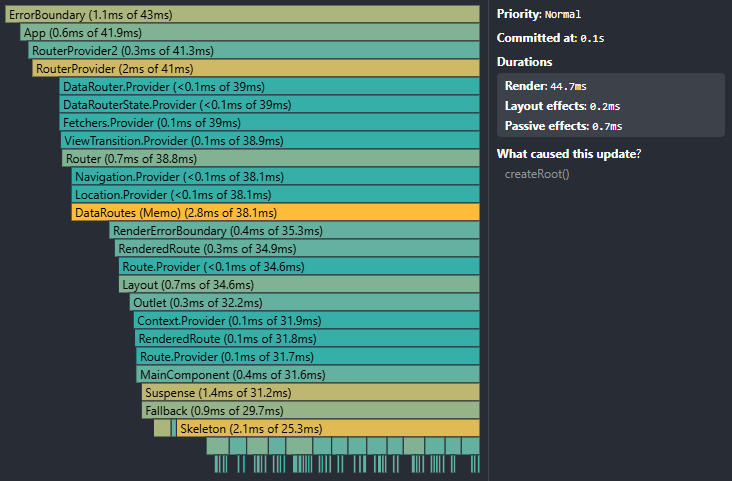

_Column Selection_

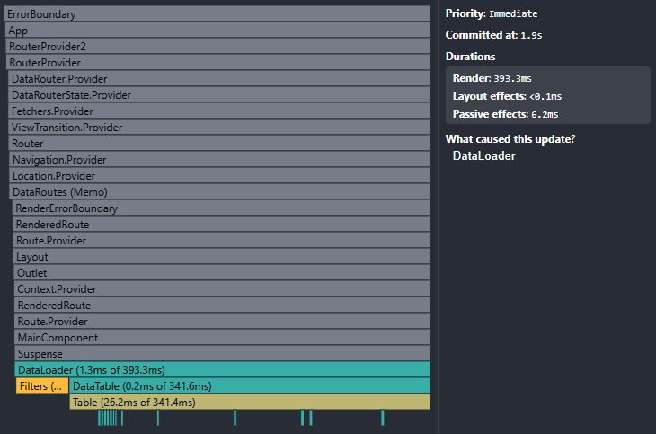

_Year Change_

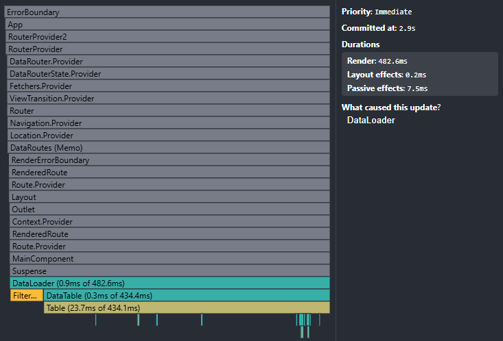

_Sorting_

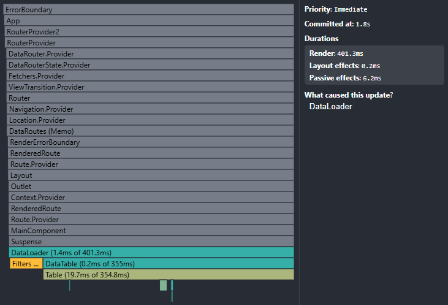

_Search_

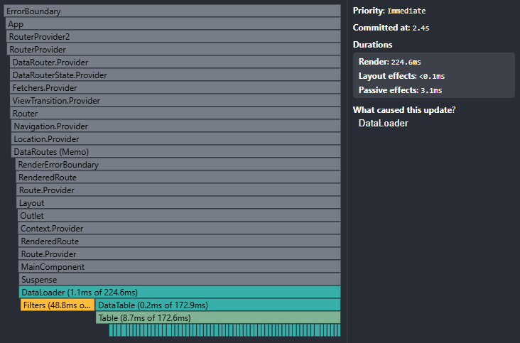

#### After Optimization

| Action                       | Render Time (ms) | Components Affected                         | Improvement |
| ---------------------------- | ---------------- | ------------------------------------------- | ----------- |
| Initial Load                 | 43.8             | All components                              | 3.1%        |
| Column Selection (5 columns) | 201.3            | DataLoader DataTableOpt TableOpt            | 51.2%       |
| Year Change (first change)   | 476.2            | DataLoader FiltersOpt DataTableOpt TableOpt | 4.4%        |
| Year Change (re-change)      | 287.4            | FiltersOpt DataTableOpt TableOpt            | 42.3%       |
| Sorting (first sorting)      | 398.7            | DataLoader DataTableOpt TableOpt            | -2.8%       |
| Sorting (re-sorting)         | 156.3            | FiltersOpt DataTableOpt TableOpt            | 59.7%       |
| Search (first search)        | 178.9            | DataLoader FiltersOpt DataTableOPt TableOpt | 5.7%        |
| Search (re-search)           | 72.4             | DataLoader FiltersOpt                       | 61.8%       |

**Screenshots:**

_Initial Load_

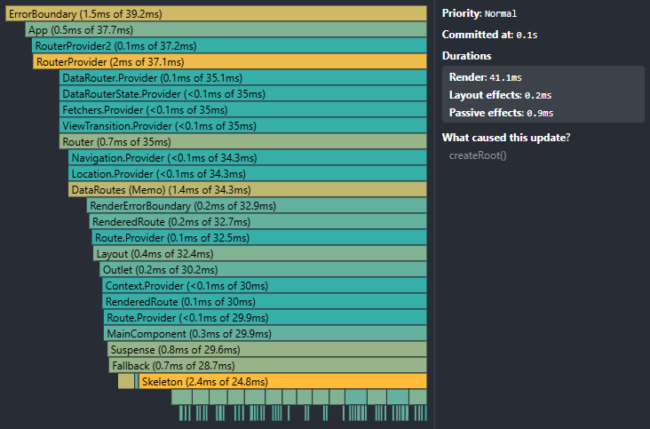

_Column Selection_

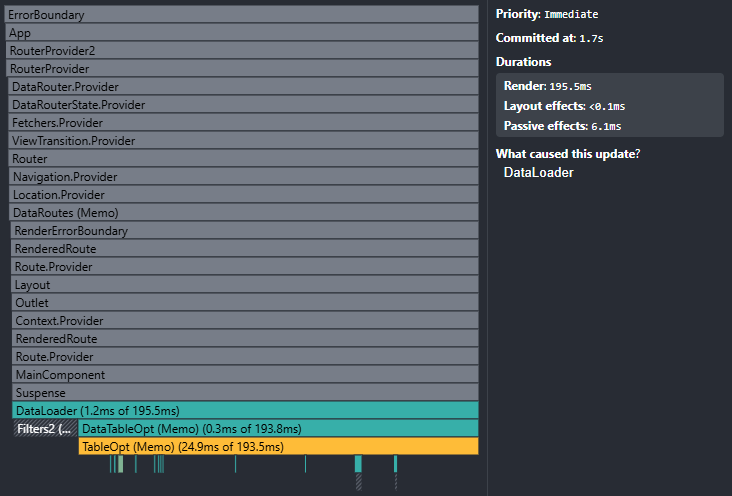

_Year Change (first change)_

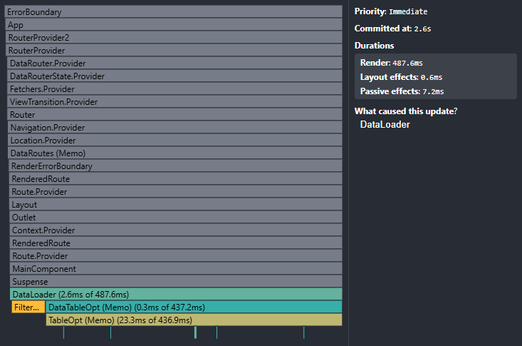

_Year Change (re-change)_

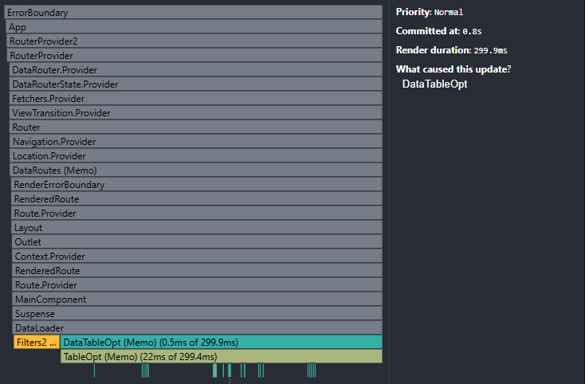

_Sorting First_

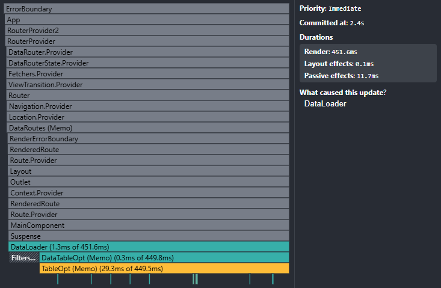

_Sorting Re-sorting_

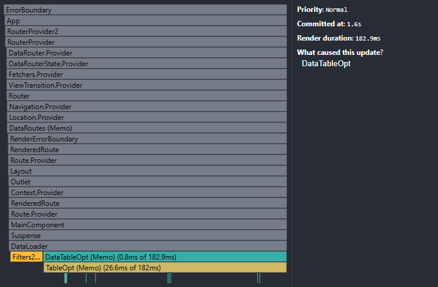

_Search First_

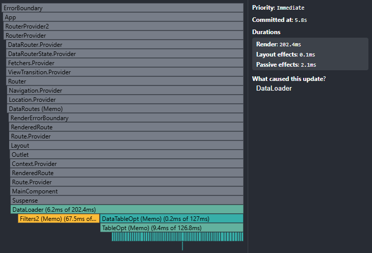

_Search Re-search_

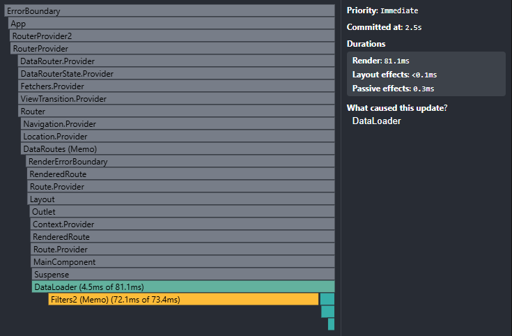

## Application Features

### Data Visualization

- Interactive table displaying CO2 emissions data for countries worldwide
- Mandatory columns: Country, ISO Code, Year, Population, CO2, CO2 Per Capita
- Optional columns based on available data fields

### Filtering & Search

- **Year Selection**: Dropdown to select specific year (defaults to most recent)
- **Region Filtering**: Filter countries by geographic region
- **Country Search**: Real-time search by country name

### Visual Enhancements

- **Change Highlighting**: Data cells highlight when values change between years
- **Responsive Design**: Optimized for various screen sizes
- **Loading States**: Skeleton components during data fetching

### Performance Features

- **Web Worker Data Loading**: Non-blocking JSON parsing with real-time progress updates
- **React Suspense**: Efficient lazy loading with fallback components
- **Memoization**: Strategic use of React.memo, useMemo, and useCallback
- **Error Boundaries**: Comprehensive error handling and recovery
- **State Management**: Zustand for lightweight, efficient state handling

---

## Data Source

The application uses **Data on CO2 and Greenhouse Gas Emissions** by **Our World in Data**:

- **Repository**: https://github.com/owid/co2-data
- **Original data file**: https://nyc3.digitaloceanspaces.com/owid-public/data/co2/owid-co2-data.json
- **File size**: 100MB+ JSON dataset

The dataset contains comprehensive environmental statistics for countries worldwide, including:

- CO2 emissions (total and per capita)
- Population data
- GDP information
- Energy consumption statistics
- Historical trends across multiple years

_Note: The large dataset size requires web worker implementation and optimization techniques for smooth user experience._

---

## Development Notes

### State Management

- Column selection is managed through Zustand store
- Filter states are handled locally within components
- Performance optimization controlled by environment variable

### Component Architecture

- **Separated optimized/non-optimized components** for better testing and control
- **Web worker integration** for non-blocking data operations
- **Error boundaries** with RouterErrorFallback for robust error handling
- **CSS Modules** for scoped styling
- **TypeScript interfaces** for type safety

### Performance Considerations

- **Web worker** prevents UI blocking during large file processing
- **Batched updates** for responsive column selection
- **Change detection** only triggers on year modifications
- **Component isolation** allows selective optimization testing

---

## Conclusion

The performance optimization implementation demonstrates the effectiveness of React's memoization techniques in real-world applications handling large datasets. The analysis reveals distinct performance patterns that highlight the strategic value of optimization.

### Key Findings

**Initial Rendering Performance:**

- First-time operations show minimal or slightly negative performance impact
- React.memo, useMemo, and useCallback introduce setup overhead
- Initial load times remain virtually unchanged (0% improvement)

**Subsequent Rendering Performance:**

- Dramatic improvements in repeated operations:
  - Re-sorting: **59.7% faster**
  - Re-searching: **61.8% faster**
  - Re-year changes: **42.3% faster**
- Memoized components skip unnecessary re-renders
- Cached calculations eliminate redundant processing

### Optimization Mechanisms

**React.memo:** Prevents component re-rendering when props haven't changed, particularly effective for table rows and cells that remain static during sorting operations.

**useMemo:** Caches expensive calculations like data filtering and sorting, providing significant performance gains when the same operations are repeated.

**useCallback:** Stabilizes function references, preventing child component re-renders caused by new function instances.

**Strategic Implementation:** The environment-based optimization toggle with separated component files allows for precise performance comparison and demonstrates that optimization benefits compound with user interaction frequency.

**Web Worker Integration:** Non-blocking data loading prevents UI freezing during large file processing, maintaining application responsiveness even with 100MB+ datasets.

### Real-World Impact

While initial operations may be slightly slower due to memoization overhead, the application becomes significantly more responsive during typical user workflows involving repeated filtering, sorting, and searching. This trade-off proves beneficial for interactive applications where users perform multiple operations on the same dataset.

The optimization strategy successfully transforms a potentially sluggish large-dataset application into a responsive user experience, with performance gains becoming more pronounced as users interact with the interface.
